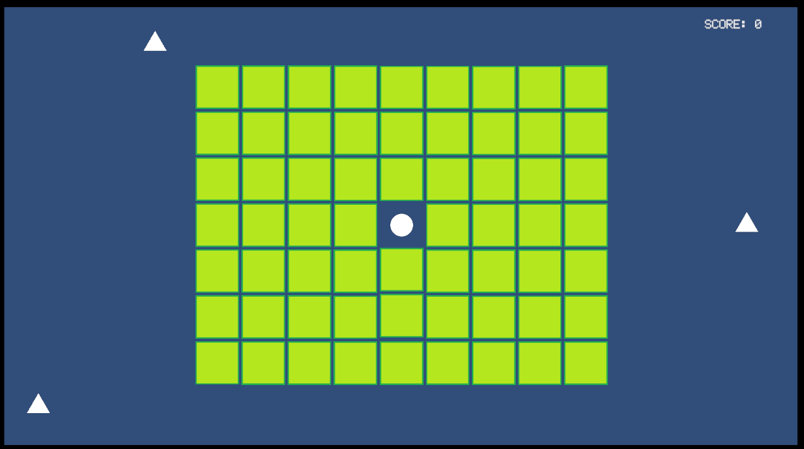

<h1 align="center">🐭 Rodent's Revenge Clone 🧱</h1>

> This project is a clone of the classic game *Rodent's Revenge*, built using Unity. The game is a puzzle game where the player controls a mouse that must trap cats by pushing blocks.

<p align="center">
  
</p>

---

## 🎮 Game Overview

Rodent's Revenge is a tile-based puzzle game where the player (a mouse) must strategically push blocks to trap enemy cats. This Unity remake brings back the original mechanics with some added improvements and modularity for easier expansion.

### ✅ Features Implemented

- Grid-based movement for Player, Blocks, and Enemies.
- Player can push one or more blocks at once.
- Enemies move randomly and transform into consumable objects if blocked for too long.
- Player can collect consumables and earn points.
- Inspector-friendly scripts — all main variables are editable in Unity Editor.
- Collision and blocking logic between player, enemies, and blocks.

---

## 🧪 Requirements

- **Unity**: 2022.3.32f1 or newer
- **Platform**: Windows, macOS, or WebGL
- **Git**: for version control

---

## 🚀 Getting Started

1. Clone this repository:
   ```bash
   git clone https://github.com/michelbr84/RodentsRevengeClone.git

2. Open the project in Unity:

   * Go to `File > Open Project` and select the cloned folder.
   * Load the `Main.unity` scene under `Assets/Scenes`.

3. Press ▶️ Play in the Unity Editor to start the game.

---

## 📂 Folder Structure

```
RodentsRevengeClone/
├── Assets/
│   ├── Scenes/
│   ├── Scripts/
│   ├── Prefabs/
│   ├── Sprites/
│   ├── UI/
│   └── Images/
│       └── screenshot.png
├── ProjectSettings/
├── Packages/
├── .gitignore
├── README.md
└── LICENSE
```

---

## ✅ To-Do List

### ✔️ Completed

* [x] Grid-based movement system
* [x] Multi-block pushing by Player
* [x] Enemy random movement
* [x] Enemy transforms into Consumable if blocked
* [x] Player collects Consumables and scores
* [x] Editable variables in Inspector
* [x] GitHub integration and version control setup
* [x] README.md documentation

### 🔧 In Progress / Planned

* [ ] Add animations for mouse, cats, and transformations
* [ ] Sound effects for moving, collecting, and winning
* [ ] Main menu UI and pause screen
* [ ] Victory and Game Over conditions
* [ ] Level system with increasing difficulty
* [ ] Timer or move count tracking
* [ ] Mobile controls / WebGL build polish
* [ ] Polish sprites and UI assets
* [ ] Add scoring leaderboard

---

## 📜 License

This project is licensed under the [MIT License](LICENSE).

---

## 🤝 Contributions

Contributions, ideas, and bug reports are welcome!
Fork the repository and submit a Pull Request with your improvements.